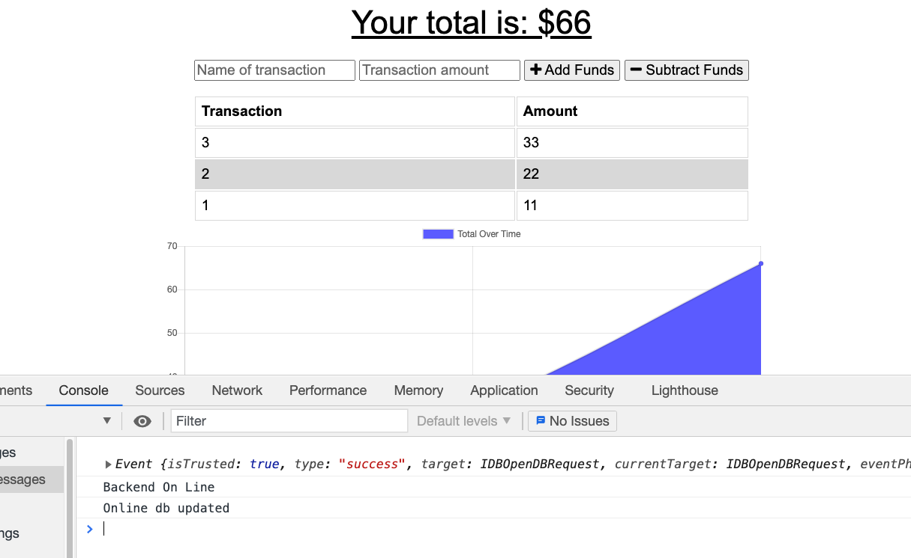
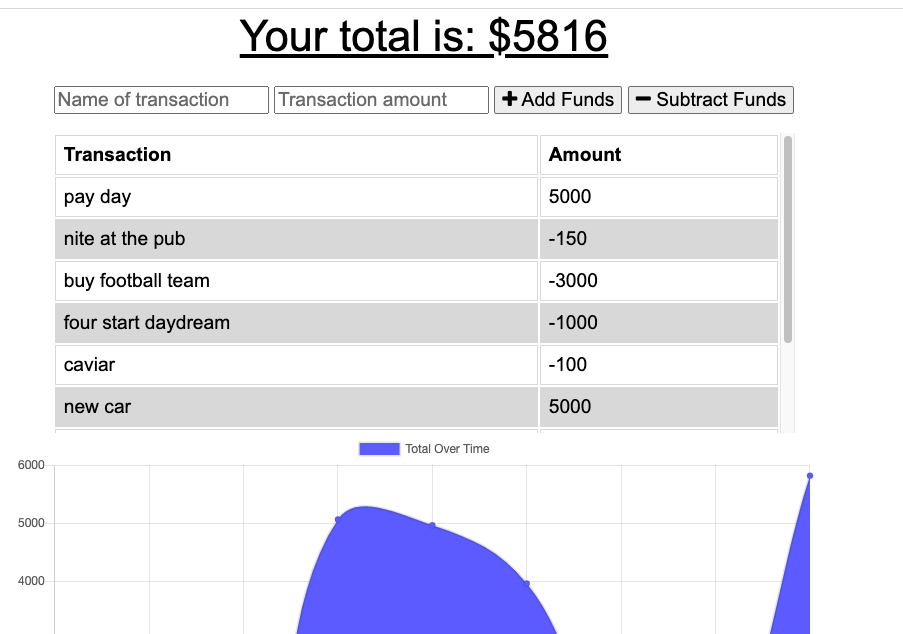

# Mo-Money-18PWA
Travelers budget tracker working on Online/Offline

# Link to Heroku Deployment 
https://serene-coast-45960.herokuapp.com/
# App screenshot

# Description 
Budget tracking app allowing the user to keep available funds up to date while experencing poor connectivity or offline periods by being in remote areas. 
This app will store user data entries using the service worker while off line. Once connectivity resumes, the database stored will be updated and delivered to the online database Mongodb. This is important so the user always knows the state of their funds or data.

# Technoligies Used 
- Webmanifest
- Mongodb
- Mongoose
- IndededDB
- Express
- Service Workers
- Node 
- Javascriopt
- CSS
- Heroku 

# Questions
Visit my GitHub: https://github.com/adams1971

Mail to: [adamscdcm@gmail.com](mailto:adamscdc@gmail.com)
